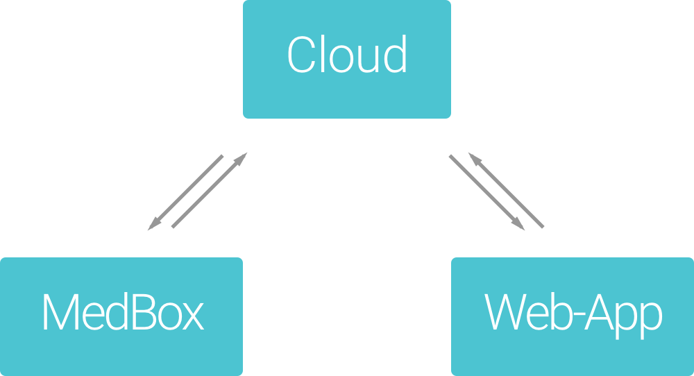

# MedBox
An intelligent Medicine Assistant

### Contributors:
Valentin Barth, Laura Wernicke, Christopher Battista

## Logo

## Problemstellung
Aus bisherigen Recherchen hat sich ergeben, dass die meisten Gefragten Probleme damit haben die rechtzeitige und korrekte Ennahme von Medikamenten in ihren Alltag einzubringen. Fehleinnahme, Über- und Unterdosis sind häufig die Folge. Dies spitzt sich noch mehr zu, wenn mehrere Medikamente zu verschiedenen Zeiten eingenommen werden müssen.
Hier kann gleichzeitige Einnahme der falschen Medikamente verheerende Nebenwirkungen haben. Deshalb sind grade Senioren auf Familienangehörige angewiesen, welche die Verantwortung der richtigen Einnahme übernehmen.

## Brachnech

## Architektur

Cloud:
+ Die Kontodaten der Nutzer werden hier verwaltet
+ Sendet Erinnerungen an die Medbox
+ Sendet Push Nachrichten an die Web-App
+ Medikamenten-Datenbank für Vorschläge

MedBox:
+ Erinnerung
    + Über Led und vibration
    + Zeigt Füllstand an
    + Zeigt an wie viele Tabletten genommen weden müssen
+ Gibt keine Tabletten aus bei falschem Zeitpunkt

Web-App:
+ Nutzer oder Angehöriger kann hier seine Medbox kofigurieren und verwalten
+ Push Nachrichten werden hier angezeigt
+ Barcodescanner

## Schaltplan

Komponenten
+ Stromversorgung
    + Li-Po Zelle für die Stromversorgung (1)
    + Spannungsregler regelt spannung herunter auf 3.3V (2)
    + An-Aus-Schalter (3)
+ Kommunikation
    + Esp8266 WLAN Modul sendet und empfängt Nacherichten über Websockets (4)
+ Aktor
    + Servo um die Falltür der Tabletten auf und zu zu machen (5)
    + Rgb-Led um auf sich aufmerksam zu machen (6)
    + Oled Display für die Anzeige (8)
+ Sensor
    + Druckknopf zur Anfrage von Tabletten (7)